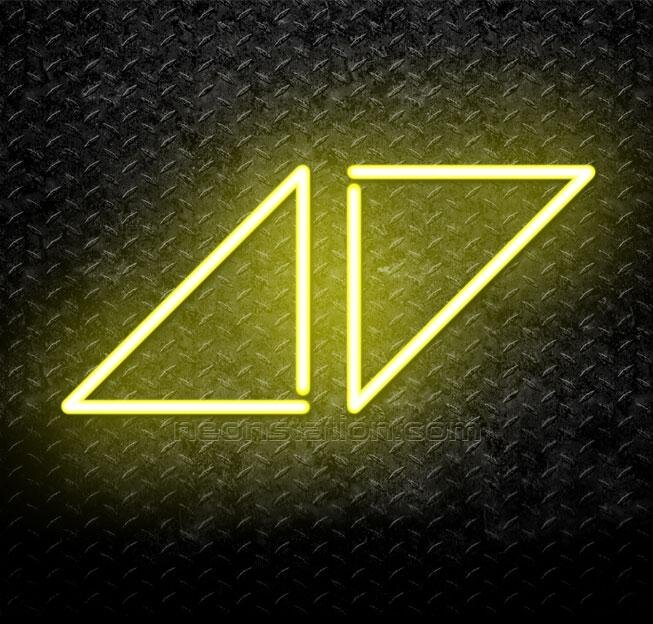

# Avicci light

# Introduction

[https://github.com/vietphan1995/avicci-light.git](https://github.com/vietphan1995/avicci-light.git)

Avicci light is a hard ware helps warning signal for your vehicle, especially your bike, primitive vehicle, in which you can join traffic safety with light turn signal.

Avicci light has many pieces in triangle arrow shape in hand size, these pieces can pair with a hub as your smart phone/smart glass, you can send turn signal from hub with correspond experience like touch on smart phone screen, tap or look back on smart glass.

Avicci light pieces can be attached on any vehicle, it does not have limit in quantity to make sure you having enough turn signal from front, back, right left side of your vehicle.  Avicci light can be attached on fense/wall for navigate, warning signal purpose.

### Notes
https://six-zinc-ad4.notion.site/Avicci-light-1b25e832d6ee807c8f47d3819b816db7